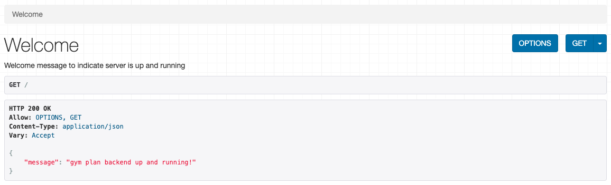
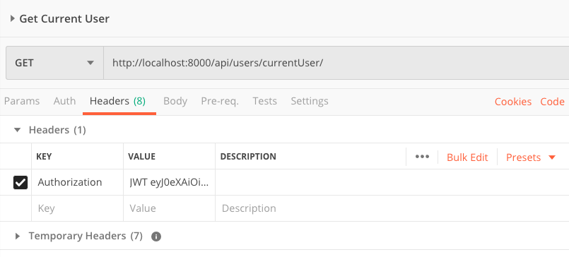

# gym-plan-backend

## Project Overview
This repo is the backend of an application called "Gym Plan".  For more information on the overall purpose/intent of the application, please reference the front-end repo linked below.

## Important Links
- [Front-end repo](https://github.com/allenjosephs/gym-plan)
- [Back-end repo (yes, the repo that you're currently in)](https://github.com/lilspikey333/better_IMDB)

## Technologies Overview
- Django
- Django REST Framework (DRF)
- PostgresSQL
- JSON Web Tokens (JWT)

## Prerequisites for setting up this application locally
- Python (recommend v3.8.0+)
- Python virtual environment
- PostgreSQL (recommend v12.1+)

## Setup Instructions
>**Note: The below actions were performed on a Mac and assumes Python v3+**
- Clone down this repo and `cd` into the local directory
- Activate a python virtual environment: `python3 -m venv .env`
- Set up a local PostgreSQL db
    - From a terminal: `psql`
    - `CREATE DATABASE gym_plan;`
    - `CREATE USER gym_plan WITH PASSWORD '<your password here>';`
    - `GRANT ALL PRIVILEGES ON DATABASE gym_plan TO gym_plan;`
    - `\q`
- Run the migrate command: `python3 manage.py migrate`
- Create superuser (using any desired username/pwd): `python3 manage.py createsuperuser`
- Install the Django REST framework: `pip install djangorestframework`
- Install the Django REST framework JWT library: `pip install djangorestframework-jwt`
- Install CORS: `pip install django-cors-headers`
- Start the server: `python3 manage.py runserver`
- Verify server is started by visiting http://localhost:8000 in a browser
- The following image indicates success
> 

## User Authentication
- Most `GET` routes are accessible to anonymous users whereas all `POST`, `PUT`, `DELETE` routes require a user account and a valid JWT
- If a user's JWT refresh token has expired, the user will be required to log in again
- In order to obtain a JWT for a given user, that user must first exist in the database

## Routes
| Route                     | Description                                             |JWT Auth Req'd |
|:-------------             |:-------------                                           |:------------|
| `/`                       | Display welcome message to indicate server readiness    | No   |
| `admin/`                  | Access the built-in Django admin utilities              | No   |
| `token-auth/`             | "Log in" the user, returning new token and user details | No   |
| `token-auth/refresh/`     | Obtain a refreshed token using a currently active one   | Yes  |
| `api/users/create/`       | Create new user by providing credentials                | No   |
| `api/users/currentUser`   | Return currently-logged-in-user details                 | Yes  |

## Usage Hints
- When performing a `GET` call on an authorized route, pass the JWT in the `Authorization` header variable with a value = The string literal 'JWT' followed by a space followed by the JWT itself
    - Example using httpie: `http http://localhost:8000/users/currentUser Authorization: JWT <token>`
    - Example using Postman:
    > 

## Models used in this application
- Exercise
    - XXX

- Workout
    - XXX

- User
    - name

## New skills I learned during the process of creating this project
- Python decorators
- JSON Web Tokens

## References
The following resources were vital in assisting me with successfully implementing various aspects of this application.

- JWT
    - [How to Use JWT Authentication with Django REST Framework](https://simpleisbetterthancomplex.com/tutorial/2018/12/19/how-to-use-jwt-authentication-with-django-rest-framework.html)
        > Note that while this article demonstrates the usage of the Simple JWT library, the Gym Plan application utilizes standard JWT.
    - ["httpie": A handy command line tool for testing http requests in Terminal](https://httpie.org/)
